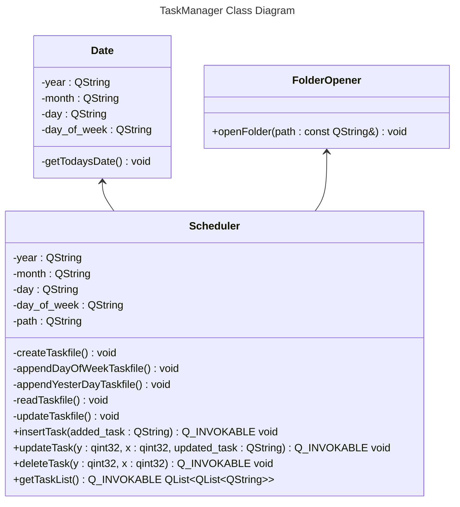
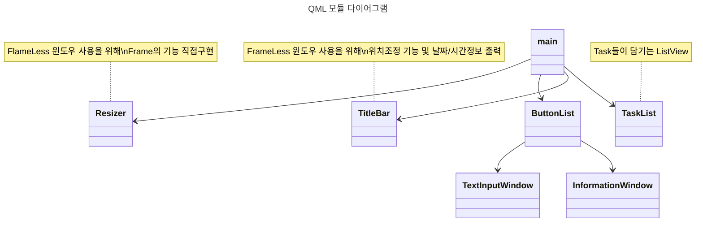

# \[개인 프로젝트 / C++, Qt\] TaskManager

## 목차
1. 개요
2. 프로젝트 개요
3. 프로젝트 사용 방법
4. 프로그램 구성
5. 사용된 기술
6. 고충 및 해결방법
7. 링크

___
## 1. 개요

해야할 일(Task)들을 관리하는(Manage) 프로그램이라는 뜻입니다.  
윈도우 작업관리자(Ctrl + Shift + ESC 입력시 나오는 창)와 같은 이름이기도 합니다.  


---
## 2. 프로젝트 개요

#### 1) Task 리스트 자동 생성
- **매일 해결해야 할 일**들의 리스트를 자동으로 나열해줍니다.  
- **요일별 해결해야 할 일**들의 리스트 또한 자동으로 추가됩니다.  
- **지난날 해결하지 않고 미루어둔 일**들의 리스트 또한 자동으로 추가됩니다.

#### 2) 간편한 사용법
- 나열되어 있는 일들 중 해결한 일은 더블클릭으로 목록에서 **제거**할 수 있습니다.  
- 해야할 일을 변경해야 한다면 우클릭으로 간단히 내용을 **변경**할 수 있습니다.  
- 기존 일정 외에 해야할 일이 더 생긴다면 내용을 **추가**할 수 있습니다.  
- 특정 날짜에 해야할 일정을 미리 추가해둔다면 해당 날짜에 리스트에 반영됩니다.

#### 3) 시각적 효과
- 중요도에 따라 일의 목록을 다르게 나타냅니다.  
- 기본적인 일은 **푸른 배경**에 흰 글씨로 나타냅니다.  
- 중요도가 높은 일은 **검은 배경**에 금색 글씨로 나타냅니다.  
- 지난날에 해결하지 않고 미뤄둔 일들은 **붉은 배경**에 회색 글씨로 나타냅니다.

#### 4) 인터페이스 구성
- 시간과 날짜가 표시됩니다.  
- 해야할 일들의 리스트가 나열됩니다. 리스트가 많다면 스크롤을 하거나 창의 크기를 조절할 수 있습니다.  
- 버튼을 이용해 할일을 추가하거나 일정을 관리하는 등의 기능도 수행할 수 있습니다.

---
## 3. 프로젝트 사용 방법

#### 1) 처음 다운로드를 받았다면?
처음 다운로드를 받았다면 **프로그램 실행 전에** 매일 해야할 일들 및 각 요일별 해야할 일들의 목록을 초기설정합니다.  
처음 설정만 해두면 다음부턴 매일 해야할 일들의 목록이 자동으로 반영됩니다.  

#### 1-1) 작성 요령
- 중요도가 높은 일의 경우 ★을 붙여주면 높은 우선순위로 표현됩니다.(ex. ★중요한일1)  
- 한줄에 여러개의 리스트를 표현하고 싶다면 \#으로 구분하면 됩니다.  
- 예를들면 아래처럼 작성하고 저장하면됩니다.
```
#★1일 1커밋
#공부 #디자인 패턴 1개 #CS 정리 30분공부 #Project
#할일1 #★중요한일 #할일1-2
#할일2 #할일2-1
#할일3
```

#### 1-2) 설정방법
Release -> Schedule -> fixed_schedule 경로로 들어가서 everyday.txt 파일 및 각 요일.txt파일에 내용을 반영하고 저장합니다.  
각 파일에 일정을 작성한다면 매일 프로그램 실행시 리스트에 반영됩니다.  
일정 파일을을 모두 작성했다면 TaskManager.exe 파일을 실행하면 됩니다.  

#### 2) 사용 요령
- 매일 사용하게 되는 프로그램이므로 바탕화면에 바로가기를 만들어 두고 사용하면 편리합니다. 
- 일을 **해결했다면** 해당 Task를 더블클릭하면 리스트에서 삭제됩니다.
- 일을 **추가하고 싶다면** 오른쪽에 할일 추가 버튼을 사용해 할일을 작성한후 엔터를 누르면 해야할 일이 추가됩니다.
- 일을 **변경하고 싶다면** 표시된 Task를 우클릭하고 변경할 내용을 작성 후 엔터를 누르면 해당 Task가 변경됩니다.
- **특정 일자에 일정을 추가하고 싶다면** 일정 관리에 해당 날짜 경로로 가서 해당 날짜의 파일을 만들고 일정에 대해 적은 후 저장하면 해당 일자에 내용이 반영됩니다. 예를들어 2024-11-05에 "내 생일"이라는 일정을 미리 추가해두고 싶다면 아래의 사진처럼 Schedule -> 2024 -> 11 폴더 경로를 만들고 05.txt파일에 `#내 생일` 이라고 작성하면 됩니다.  


---

## 4. 프로그램 구성

version 1.0으로 개발하고 릴리즈 한 시점의 Class Diagram입니다.  
현재는 디자인패턴 공부 후 클래스 구현에 대해 많은 깨달음을 얻고 version 2.0을 위해 리팩토링 중입니다.  

#### 1) C++ Class Diagram


#### 2) QML 모듈 다이어그램


---

## 5. 사용된 기술

- Qt Quick  
- C++

인터페이스를 위해 Qt Quick의 qml을 사용했고 내부 처리를 위해 C++을 사용했습니다.    
C++의 파일입출력을 이용해 일정 파일을 생성하며 읽어와서 이중 List에 넣어 사용했습니다.  
Qt Quick의 qml을 이용해 Frameless Window를 만들고 ListView등을 이용해 Task들을 나열하여 표현했습니다.  

#### 해당 기술들을 사용한 이유
1) C++을 선택한 이유  
- 우선은 윈도우에서 사용할 프로그램이므로 C++을 선택했습니다.
- 개인 일정을 다루는 프로그램이므로 데이터베이스 서버에 업로드하기보다는 개인 PC내에서 **파일입출력**을 통해 처리하고자 했습니다.

2) Qt Quick을 선택한 이유  
- Qml과 C++을 분리해서 디자인부분과 코드부분을 관리할 수 있었습니다.  
- 이미 잘 다루는 C++로 개발할 수 있기에 디자인 부분을 담당하는 qml만 배우면 된다는 점에서 부담이 적었습니다.  
- **크로스플랫폼** 개발을 경험해보고 싶어서 선택했습니다.

또한 윈도우 GUI 프로그램을 만들기 위한 플랫폼을 선택하기 위해 많은 정보조사를 했습니다만 아래의 환경들은 해당 이유로 선택지에서 제외되었습니다.  
- Win32 Api 및 MFC : 성능 중시 분야를 제외하고는 신규 프로젝트보다는 유지보수에 사용되며, 현재는 다소 과거의 개발 환경으로 여겨지는듯 했습니다.  
- Electron : 실행환경에 거의 영향을 받지 않는다고 볼 수 있는 웹 기반 GUI를 표현한다는 장점이 있었지만 HTML, CSS, JavaScript를 익혀야하므로 현시점에 당장 만들어보기에는 학습량이 배보다 배꼽이 더 커질 수 있는 상황이었기에 다음 기회로 미뤄두기로 했습니다.  
- nana 및 WinUI3 : C++에는 익숙하지만 GUI 개발환경은 새로 익혀야 하는 입장에서 자료가 너무 적었기에 아쉽게도 후순위로 밀리게 되었습니다.  
- Winform 및 WPF : 윈도우 프로그램을 만들기에 아주 좋은 선택지였지만 C#은 기초문법정도만 공부했던 상황인지라 Electron과 마찬가지로 학습량의 벽이 있었고, 무엇보다 .NET 환경에서만 작동 가능하다는 점이 Qt의 크로스플랫폼에 밀렸습니다. 다만 WPF는 다음 학습목표로 두고 꼭 배워보고 싶은 목표가 되었습니다.

더 자세한 조사내용은 아래의 글에 정리해두었습니다.  
[[데스크탑 GUI 툴]]

---

## 6. 고충 및 해결방법

#### 1) Qt Creator 사용 경험
이 프로젝트를 처음 시작할때만해도 Qt Creator를 사용한 개발 경험은 없었고, 학습하는 수준에서만 사용해봤었습니다. 그렇다보니 최초 기획에 구현할 계획이었던 기능들 중 C++로 해결할 기능부분은 익숙한 Visual Studio로 먼저 개발을 마친 후 작동에 문제가 없는것을 확인하고 Qt Creator로 옮겨왔습니다.  

하지만 호환 및 언어버전 때문에 몇몇 문제가 발생했습니다. 우선 Visual Studio에서는 프로젝트 설정으로 C++ 20까지 사용이 가능했지만 Qt Creator에서는 C++ 17까지는 문제없이 사용 가능했지만 C++ 20부터는 다소 완벽하게 사용이 불가능한점이 있었습니다.  

그렇다보니 결국 Qt의 자체 라이브러리로 다시 구현해야 하는 내용들이 발생했습니다. 이때 이후로는 모든 개발을 Visual Studio가 아닌 Qt Creator에서 시작해서 끝내게 되었습니다.  

#### 2) Qt Creator의 불친절
Schduler 클래스를 완벽하게 구현한 후 qml과 integration을 위해 몇몇 함수를 Q_INVOKABLE로 설정하려고 했으나 아무리 설정을 바꾸고 connect를 해도 반영이 안됐습니다.  
몇시간째 해결책도 내지 못하고 있다가 그냥 프로젝트 빌드가 아닌 Qmake빌드를 한번 해줬더니 바로 모두 정상적으로 적용이 됐습니다.  

또한 Qml을 모듈화하기 위해 여러개의 qml 파일로 나누게 되었고 문제없이 잘 나누었지만 계속해서 main.qml에서 모듈화된 qml들을 인식하지 못하는 문제가 발생했습니다. 이 문제 또한 알아차리기까지 시간이 아주 오래걸렸었습니다.  
문제는 프로젝트의 makefile이라고 할 수 있는 Qmake의 .pro파일에 새로 만든 qml들이 추가되어 있지 않았다는 것이었는데 IDE에서 파일추가를 해서 작성한 파일들인데 프로젝트에 추가는 또 따로 해줘야 한다는점이 당황스러웠습니다. 하지만 .pro파일만 잘 건드려주면 프로젝트에 파일추가는 쉽게 가능했습니다.  

빌드의 종류가 여러가지라는 것을 몰랐고, 파일을 프로젝트에 직접 추가도 해줘야 한다는 불친절로 인해 틀린것도 없이 많은 시간낭비를 하게됐었습니다. 이를 통해 처음 개발을 배우면서부터 사용했던 Visual Studio가 백그라운드에서 얼마나 많은 일을 처리해주는 IDE였는지 깨닫게 되었습니다.  

#### 3) 날짜 및 시간 표기
오늘의 일정을 나열하는 프로그램인 만큼 날짜와 시간을 프로그램에 표시하는것이 좋다고 생각했습니다. 이를 구현하기 위해 비슷한 시기에 공부했던 modern C++의 chrono라이브러리를 사용하여 구현했었습니다.  

하지만 위의 Qt Creator C++ 버전 문제로 chrono라이브러리 사용이 불가능해서 해당 코드는 폐기해야 했고 대신 qml쪽에 자바스크립트로 아주 간단하게 시간을 출력할 수 있는 함수가 있어서 해당 함수를 활용하게 되었습니다.  

#### 4) 첫 실행인지 재실행인지 구분이 필요하다
프로그램을 처음 실행했을 때에는 오늘 날짜에 해야할 일들을 파일에 추가해줘야 합니다. 그런데 만약 프로그램을 종료했다가 재실행한다면 오늘 일정을 또 추가해선 안됐습니다. 그러므로 이미 한번 실행되었는지 확인할 수 있는 기능이 필요했습니다.  

이 고민은 일정파일을 가져와서 파싱하는 인터프리터 클래스를 구현하는 시점에서의 고민이었습니다. 일정 파일이 저장되어있는 save파일만 가져와서 해당 내용을 판단할 수 있어야 했기에 일정파일에 표시를 해야 했습니다. 결국 간단하게 첫 실행시 일정 파일의 마지막에 # 하나를 추가하고 재실행시 확인하는 방법으로 해결했습니다.  

간단한 아이디어로 해결함으로써 일정 save파일 원문을 볼때도 불편함이 없게 확인할 수 있고 파싱도 단순하게 할 수 있도록 만들 수 있었습니다.  

#### 5) 지난날 해결하지 않은 일들을 추가하는 방법
만약 해결하지 않은 일이 있는 상황에서 프로그램을 종료한다면 다음날 해당 일들이 오늘의 일정 밑에 추가되도록 만들고자 했습니다.  
구현할 방법을 고민했고 방법으로는 하루 전 날짜를 계산해서 해당 파일의 내용을 읽어오도록 하는 방법과 종료시점에 해결하지 않은 일들을 따로 저장하는 save파일을 만드는 방법등을 떠올렸습니다.  
선택한 방법은 프로그램 종료시 해결하지 않은 일들을 저장할 yesterday.txt 파일을 만들고 해당 파일에 해결하지 않은 일들을 저장하고 다음번 프로그램 실행시 날 추가하고자 했습니다.  

하지만 같은 날에도 프로그램을 종료 후 재실행시 해당 내용이 추가되는 등의 문제가 발생했습니다. 그렇다보니 yesterday.txt파일을 오늘 날짜의 파일과 같게 계속 갱신해주며, 또한 1번 항목과 같게 오늘 일정 파일에 \#이 붙어있다면 yesterday.txt가 이미 append 되어있다는 뜻으로 사용하게 되었습니다.  

#### 6) 화면의 공간을 많이 차지하면 안된다
오늘 해야할 일들의 목록이므로 화면의 한 켠에 켜두고 사용할 일이 많다고 예상했습니다. 그렇다보니 화면의 많은 공간을 차지하면 안되므로 불필요한 제목표시줄 등을 없애고자 했고 Frameless 윈도우로 변경했습니다.  

하지만 윈도우에서 제공하는 Frame은 단지 제목만 표시하는것이 아니라 창의 크기 조절이나 창의 이동 등 다양한 기능들을 제공해주는데 Frameless로 설정 시 해당 기능들도 모두 사용할 수 없게 되었습니다. 따라서 해당 기능들을 모두 직접 구현해서 인터페이스안에 잘 반영하여 창의 크기 조절과 위치 이동 등의 Frame이 제공하는 기능들의 사용 또한 가능하도록 추가해야 했습니다.  

그 과정에서 최소화, 최대화, 종료버튼 뿐 아니라 드래그해서 창의 크기를 조절할 수 있는 MouseArea와, 시간 및 날짜가 표시되어 있는 TitleBar를 클릭해서 드래그하면 창을 옮길 수 있어야 했고, 또한 창을 옮기는 과정에서 x, y좌표가 계산되는 속도가 마우스의 움직임보다 느려서 jiggle현상이 발생했는데 이점을 qml이 아닌 C++로 커서 위치를 얻어와서 해결하는 등 많은 기능을 추가해야 했습니다.  
이 과정에서 윈도우 운영체제가 기본제공하고 있는 성능들이 당연한것이 아닌 아주 많은 노력이 들어간 잘 만들어진 프로그램이었음을 알게 되었음과 동시에 Qt Quick 프로그램 개발에 대한 경험이 많이 쌓이게 된 부분이었습니다.  
관련 내용 : [https://stackoverflow.com/questions/18927534/qtquick2-dragging-frameless-window](https://stackoverflow.com/questions/18927534/qtquick2-dragging-frameless-window)

#### 7) 일정이 아주 많다면 화면내에 다 표시할 수 없다
처음에는 Window내에 Rectangle을 만들고 그 안에 배경 색깔정도로만 처리한 후 일정들을 표시했었습니다. 하지만 일정이 아주 많다면 화면안에 표시할 수 없었고, 해당 경우에는 스크롤해서 일정들을 확인한다거나, 창의 크기를 키워서 더 많은 정보를 표시해야 했습니다.  
그러므로 스크롤이 가능한 ListView로 컴포넌트를 변경해서 qml을 다시 구성하게 되었습니다. 당시 Qt를 처음 사용해보는 상황이었고 qml의 모든 컴포넌트 종류와 특성을 익히고 사용한것이 아니라 그때그때 필요한 정보를 찾으며 사용했던터라 시행착오가 발생했고 불필요한 시간소비가 발생하는 경험을 하게 되었습니다.  

#### 8) 리스트 삭제시 qml에서의 표현문제
해야할 일들이 저장된 .txt파일을 프로그램이 읽어온 후 파싱해서 이중리스트 저장하도록 구현했습니다. 그리고 해당 이중리스트의 내용들이 qml에 ListView로 표현되었습니다.  

최초의 구현은 해당 ListView에서 해결한 Task를 더블클릭하면 해당 Task를 visible: false로 숨기도록 구현했었습니다. 그런데 만약 리스트들 중 어떤 리스트에 하나의 Task만 가지고 있는 리스트가 있을때 해당 Task를 더블클릭해서 지우게 되면 해당 리스트자체가 삭제되므로 해당 Task를 숨기기만 해선 안됐고 아래에 있는 리스트들이 한칸씩 위로 당겨올라와지게 표현해야 했습니다.   

하나의 값이 삭제되었을 뿐인데 모든 값들의 위치를 한칸씩 앞으로 당겨줘야 했기에 해당 위치 이후의 인덱스들을 당겨주는 방법으로 구현해줄까 했습니다. 하지만 결국 앞의 몇칸을 절약하기 위해 뒤의 몇칸을 당겨오는 로직이나, 전체 일정을 다시 갱신하는 방식이나 일정의 갯수 N일때 시간복잡도 O(N)인것은 마찬가지였습니다. 일정의 갯수 N도 개인의 하루 일정을 다루는 프로그램인 만큼 데이터의 양이 크지 않았기에 인덱스를 당겨오는 방식보다는 전체 일정을 다시 갱신하는 방식으로 구현하게 되었습니다.  

이를 위해 이중리스트의 내용이 변경될때마다 이벤트를 발생시켜서 ListView가 이중리스트를 다시 get해와서 표현하도록 구성해야 했습니다. 그래서 Scheduler 클래스의 insertTask, updateTask, deleteTask 함수들은 taskChanged 이벤트를 발생하도록 하고, qml에서는 Connections를 만들어 값이 변경될때마다 ListView를 다시 불러오게 만들었습니다.  

#### 9) 일정 save파일의 유니코드 문제
fstream 라이브러리를 이용해 파일 입출력을 할때 처음에는 그냥 0과 1로 이루어진 데이터이므로 읽을때와 쓸때만 방식이 같다면 문제가 없을거라고 생각했었습니다.  
하지만 한글을 파일에 작성하면 유니코드로 처리되어 글자마다 바이트 크기가 달라져서 항상 문장의 끝에 공백이 2칸씩 들어가는 현상이 발생했습니다. 이유를 알 수 없는 상태로 몇일간 개발을 하다가 문장 길이가 실제 파일 내용과 다르게 인식된다는것을 눈치채고 std::ios::binary옵션을 추가해 파일을 유니코드로 읽고 쓰게 변경했습니다.  

#### 10) ListView의 y축 고정
ListView에 내용이 많아서 스크롤을 내리고 아래쪽에 있는 Task를 더블클릭해서 삭제하면 ListView가 값을 다시 얻어오는 과정에서 ListView가 가장 위로 올라가는 문제가 있었습니다. 그래서 값을 삭제하고 ListView를 다시 불러온 후 원래의 위치로 조정해주기 위해 조사를 했고 contentY 프로퍼티를 사용하게 되었습니다.  

#### 11) Overscrolling 문제
값이 제거된 후 값을 다시 얻어온 ListView를 한번 클릭해서 focus를 주기 전까진 ListView가 overscrolling되는 현상이 발생했습니다. ListView의 크기가 변동되었음에도 focus를 주기 전엔 변동된 값이 적용되지 않는것으로 보였습니다.  

이를 해결하기 위해 ListView에 강제로 포커스를 주기 위해 forceActiveFocus()를 사용해보기도 하고  nContentYChanged 컴포넌트를 사용해보기도 하는등 많은 노력을 해봤지만 어떤 방법을 사용해도 특정 부분에서 문제가 발생해 스크롤시 경계부분에서 행동을 정할 수 있는 boundsBehavior 프로퍼티를 사용해 문제를 해결했습니다.  

#### 12) 깔끔한 코드 vs 깔끔한 기능
프로젝트를 거의 완성했다고 생각하고 실제로 몇일간 사용해보니 이런 기능이 있다면 좋겠다라는 생각들이 떠올랐고 하나하나 추가하다보니 기능이 점점 추가 및 개선되었습니다.  
반면 기능이 개선되고 추가될때마다 코드는 길어지고 보기에 깔끔하지는 않아지는것을 보니 단지 깔끔하고 짧은 코드가 좋은 코드는 아니라는 생각을 또 한번 하게 되었습니다.  

#### 13) 릴리즈 파일의 문제
많은 시행착오 끝에 드디어 프로젝트를 1차버전 수준까지 완성했고, 릴리즈하여 다른 환경 및 다른 사람들이 사용할 수 있게 해서 피드백을 받고 문제점을 해결해보고자 했었습니다.  
그런데 릴리즈로 빌드하고 windeployqt를 이용해 종속파일들도 추가해서 릴리즈를 했는데 다른 테스트용 노트북에선 프로그램이 실행조차 안됐습니다. msvc 설치가 필요하다는 경고가 나타나는게 첫 시작이었습니다.  

우선 해결의 첫단계는 컴파일러를 msvc가 아닌 MinGW로 변경했고, 다시 릴리즈해보니 다행히 실행은 잘 되었습니다만 특정 기능만 사용이 불가능했습니다.  
해결의 두번째 단계는 작동하지 않는 기능의 코드들을 유심히 본 결과 PC내의 파일 경로를 사용하는 코드가 있었는데 개발한 컴퓨터의 환경과는 달리 릴리즈된 컴퓨터의 경우는 경로에 한글이 있었고 해당 부분이 의심되어 경로를 유니코드로 인코딩해서 사용하게 만든 후 릴리즈 문제는 해결되었습니다.  

#### 14) 사용자 피드백
릴리즈 파일까지 만든 후 프로젝트를 배포해 사용자 피드백을 얻고자 했습니다. 당시 공통 관심사를 가진 모임에 배포를 하기로 결정했고 해당 모임의 구성원들에게 이 프로그램이 명백히 도움이 된다고 생각했었습니다.  
하지만 78명의 구성원 중 프로그램을 요청한 인원은 예상보다 훨씬 적은 11명뿐이었습니다. 이때 쓸모있는 프로그램을 만든다고 해서 꼭 사람들이 사용하는 것은 아님을 느끼게 되었습니다.  

초기 버전을 배포할땐 오류가 발생할 여지가 많다는 점을 알렸고 원하는 기능 추가에 대한 피드백을 요청했습니다. 얼마 지나지 않아 실제로 사용이 불가능할 정도의 심각한 오류가 발생했었습니다.  
그런데 당시 피드백을 제공해 주신 분은 겨우 2명뿐이었습니다. 이를 통해 사용자 피드백을 받는 것이 얼마나 어려운지 깨닫게 되었습니다.  

힘들게 얻은 피드백을 반영하기 위해 프로그램을 개선할 때마다 코드가 더 복잡해지고 유지보수가 어려워지는 것을 경험했습니다. 이를 통해 초기에 구조를 잘 설계하고 시작해야 한다는 점과 모듈화의 중요성을 깨닫게 되었습니다. 이를 개선하기 위해 디자인패턴에 대해 공부를 하게 되었고 현재는 피처브랜치에 리팩토링을 진행 중입니다.  

---

## 7. 링크

#### 1) GitHub
[https://github.com/batsalee/TaskManager](https://github.com/batsalee/TaskManager)

#### 2) Blog
[https://smallpants.tistory.com/270](https://smallpants.tistory.com/270)
