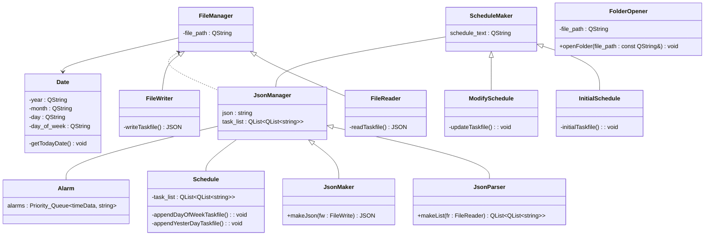

# \[리팩토링\] TaskManager

## 목차
1. 개요
2. 개선 예정 사항
3. Class Diagram
4. 계획
5. 진행상황

___
## 1. 개요

아래 링크의 TaskManager 프로젝트를 진행하면서 소규모지만 release해볼 기회가 있었습니다. 이 때 받은 피드백들과 직접 사용하면서 느낀 불편한점들을 개선하기 위해 몇몇 기능을 기능을 추가/수정했었습니다.  

하지만 기능을 추가하고 수정할수록 코드는 점점 복잡해져갔고 단순히 기능을 나누는 모듈화만으로는 한계가 있다고 생각됐습니다. 그래서 전부터 꼭 공부하고 싶었던 디자인패턴을 학습하게 되었습니다. 이를 통해 배운점들을 반영해서 기존의 프로그램을 리팩토링하고, 동시에 기능을 추가하고 개선해나가고자 합니다.

https://github.com/batsalee/TaskManager/tree/version-1.0-backup

---
## 2. 개선 예정 사항

감사하게도 사용자분들에게 피드백을 받을 수 있었고, 저 또한 오랫동안 이 프로그램을 사용해왔기에 개선해야 할 점을 많이 느껴왔습니다. 이 탭에는 개선해야 할 일들의 리스트를 작성해두고자 합니다.  

#### 개발 환경
1) 컴파일 시스템 QMake에서 CMake로 변경  
- QMake는 Qt만을 위한 빌드 시스템이라면 CMake는 더 범용적인 시스템이며 더 최신식으로 권장됨  
- version 1.0은 QMake였지만 version 2.0은 CMake를 사용해보기로 결정

#### 기존 기능 개선
1) Task 추가 옆으로도 가능하도록 **기능추가**, qml에서의 수정이 우선적으로 필요함
2) Task 추가시 리스트의 제일 아래가 아닌 제일 위에 추가되도록 **변경**
3) Task 변경시 모달에 원래의 내용이 뜨도록 **기능개선**
4) 중요도가 높아서 ★로 표기한 Task는 하루가 지나도 빨갛게 변하지 않도록 **기능개선**
5) main Window의 크기를 고정하지 않고 직전 종료시의 Window의 크기와 위치를 유지하도록 **기능추가**

#### 신규 기능 추가 및 개선
1) 리팩토링
  - 단일책임원칙 준수하도록 Scheduler 클래스 분리
  - Scheduler 클래스를 Scheduler/FileManager/JsonManager 클래스로 분리
  - 또한 단일책임원칙 및 의존역전원칙 준수를 위해 계층화 및 상속구조 구현
  - 인터프리터 패턴을 위해 클래스를 직접 구현해서 분리할지, 아니면 시간정보등을 깔끔하게 저장하기 위해 json을 채택할지에  대한 고민

2) 알람기능 추가
  - 이건 좀 도전적인 과제인데 알람 기능을 추가하기 위해 필요한 기능은 다음과 같음
  - 알람을 울리기 위해 소리가 나게 하거나 창이 팝업되어야 함
  - Task정보에 시간정보가 포함되어야 함, 이를 위해 기존의 일정파일 save방식을 모두 변경해야 함, 또한 일정파일을 읽어왔을때  시간정보가 등록되어 있는 Task가 있다면 이를 처리하기 위한 신규 클래스가 필요함
  - 이 과정에서 신규 클래스의 상속관계 계층화나 클래스 분리를 어떻게 해야할지 모르겠어서 디자인 패턴을 공부했던 계기가 되었음

3) 초기 설정 창 추가
  - 기존에는 txt파일에 직접 입력하는 식이었지만 이젠 프로그램에서 자체적으로 지원하도록 변경해줘야 할 때가 되었음

4) 위의 3번에 이어서 다른 날짜에 대한 일정 추가도 프로그램 내에서 지원하도록 구현

5) 코드 정리, 함수에 const들도 좀 붙이고 예외 처리 필요한 곳들 처리해주기

---
## 3. Class Diagram

구현 목표를 미리 충분히 기획한 후 전체 구조를 정해두고 시작할까 합니다.  
실제로 구현하다보면 처음 다뤄보는 내용들에서 구조 변화가 다소 생길 수 있지만 전체적인 틀이 변하지는 않을 듯 합니다.  

````

````

#### 각 클래스에 대한 설명
1) Class JsonManager  
- json 라이브러리 헤더 추가
- json파일의 내용과 이중리스트 내용을 보관할 멤버변수 보유  
- JsonParser 클래스와 JsonWriter 클래스의 부모클래스  
  
	1-1) Class JsonParser  
	- json to 이중리스트 파싱  
	- 스케쥴은 이중리스트에 넣음  
	- 알람정보가 있는 스케쥴은 따로 등록  
  
	1-2) Class JsonMaker  
	- 이중리스트 to json 파싱  
  
>[!note]
>json을 처음다뤄보는거라 변수가 많지만   
>만약 배열구조로 저장할 수 있다면 스케쥴만 배열로 저장하고  
>알람은 따로 객체로 저장하고  
>고정일정(매년 특정날, 매월 특정날)도 따로 객체로 지정할 수 있다면 정말 편하지 않을까 예상중입니다.  
  
2) Class FileManager  
- 파일입출력 관리자의 역할  
- File 경로를 멤버변수로 가짐  
- FileReader 클래스와 FileWriter 클래스의 부모클래스  
  
	2-1) Class FileReader  
	- 싱글턴  
	- 필요한 스케쥴 파일의 내용을 read  
	  
	2-2) Class FileWriter  
	- 싱글턴  
	- JsonMaker에 의해 작성된 내용을 파일에 write  
  
3) Class Schedule  
- 이중리스트 관리자  
- 이중리스트 내에 내용 Insert/Update/Delete 담당  
  
4) Class Alarm  
- 싱글턴  
- 등록된 알람을 우선순위큐에 push  
- 우선순위큐에서 앞에꺼부터 알람 타이밍 되면 알람 보내도록  
- 알람기능 구현이 문제  

5) Class ScheduleMaker  
- version 1.0에서는 FolderOpener가 폴더를 열고 사용자가 직접 파일의 내용을 수정했었음  
- 해당 기능을 프로그램 내에서 수정 가능하도록 구현  
- 내용 입력할 창을 만들고, 입력된 내용을 JsonMaker가 json으로 만들고 FileWriter가 파일로 저장한다.  
- 템플릿메서드 내지는 스트래티지로 뭘 열지, 어디에 저장할지는 하위클래스에서 구현  
- InitialSchedule 클래스와 ModifySchedule 클래스의 부모클래스  
  
	5-1) Class InitialSchedule  
	- 프로그램을 처음 설치시 초기설정을 위한 기능 구현  
	- everyday부터 월~일의 내용 적용  
	  
	5-2) Class ModifySchedule  
	- 이미 작성된 스케쥴을 수정하거나 새로운 스케쥴을 사전에 추가할때 사용  
  
6) Class FolderOpener  
- version 1.0에서의 FolderOpener의 일부 기능은 ScheduleMaker 클래스로 넘어갔음  
- 하지만 여전히 자료들 넣는 폴더 켜주는 기능은 유용하므로 클래스 유지  
  
7) Class Date  
- 날짜 관리 클래스  
- version 1.0의 Date 클래스에서 큰 변동은 없음

---
## 4. 계획

한동안은 기존에 공부했던 모든 내용들을 복습하면서 남는시간엔 이 프로젝트를 진행할듯합니다.  
진행 순서를 기록해두고 보면서 진행해볼까 합니다.  

#### 1) json에 대한 이해
- json 라이브러리 선택
- 현재 원하는 사용 구조는 task들은 배열의 형태로 원본 그대로 저장하고, 알람은 알람 객체로 저장하고, 고정일정은 고정일정 객체로 저장하는 구조
- 위 구조가 실현 가능한지 파악 후 조정해야할 점이 있다면 조정

#### 2) FolderOpener 클래스와 Date 클래스 구현
쉽게 구현이 가능하면서도 FileManager 클래스가 없을때 직접 파일을 조정하기 편하도록 우선으로 구현합니다.  
또한 Date클래스는 FileManager 클래스의 선행클래스이므로 우선 구현합니다.  

#### 3) FileManager 클래스 구현
json으로 원하는 저장구조와 이중리스트 구현 구조를 갖췄다면 해당 내용을 파일에 잘 저장하도록 구현합니다.  

#### 4) Schedule 클래스 구현
Schedule 클래스는 이미 version 1.0에서 잘 작동하고 있었으나 일부 기능을 위의 1, 2번탭의 내용으로 이전하므로 해당 부분에 대한 수정만 이루어지면 될 듯 합니다.  
여기까지 마친다면 클래스 구조적인 리팩토링 및 저장구조 개선은 끝이라고 볼 수 있을 듯 합니다.  

#### 5) Alarm 클래스 구현
여기서부터는 도전적인 내용이며 새로 추가되는 기능입니다.  
알람 구현에 대해 조사해보고 구현해볼까 합니다.  

#### 6) ScheduleMaker 클래스 구현
일정 파일을 직접 조작하는것이 아닌 프로그램 내에서 작성 및 수정 가능하도록 구현해보고자 합니다.  

---
## 5. 진행상황

#### 2024-07-14  
문서 작성 최종 완성  
